``` r
library(tidyverse)
```

    ── Attaching core tidyverse packages ──────────────────────── tidyverse 2.0.0 ──
    ✔ dplyr     1.1.4     ✔ readr     2.1.5
    ✔ forcats   1.0.0     ✔ stringr   1.5.1
    ✔ ggplot2   3.5.1     ✔ tibble    3.2.1
    ✔ lubridate 1.9.3     ✔ tidyr     1.3.1
    ✔ purrr     1.0.2     
    ── Conflicts ────────────────────────────────────────── tidyverse_conflicts() ──
    ✖ dplyr::filter() masks stats::filter()
    ✖ dplyr::lag()    masks stats::lag()
    ℹ Use the conflicted package (<http://conflicted.r-lib.org/>) to force all conflicts to become errors

``` r
infant_mortality <- read_csv("data/dobbsbiannualbirthsdeaths_11_08_24.csv") |>
    filter(year >= 2012) |>
    mutate(date = lubridate::ymd(paste0(year, "-", ifelse(bacode == 1, "1", "7"), "-01")))
```

    Rows: 2805 Columns: 22
    ── Column specification ────────────────────────────────────────────────────────
    Delimiter: ","
    chr  (1): state
    dbl (21): year, bacode, births_nhblack, births_nhwhite, births_hisp, births_...

    ℹ Use `spec()` to retrieve the full column specification for this data.
    ℹ Specify the column types or set `show_col_types = FALSE` to quiet this message.

## Research Team

  
[Elizabeth Stuart](https://www.biostat.jhsph.edu/~estuart/)  
Statistician, Hopkins

  
[Avi Feller](https://www.avifeller.com/)  
Statistician, UC Berkeley

  
[Alison Gemill](https://publichealth.jhu.edu/faculty/3843/alison-gemmill)  
Demographer, Hopkins

  
[Suzanne Bell](https://publichealth.jhu.edu/faculty/3714/suzanne-bell)  
Demographer, Hopkins

  
[David Arbour](https://research.adobe.com/person/david-arbour/)  
Statistician, Adobe

  
[Eli Ben-Michael](https://ebenmichael.github.io/)  
Statistician, Carnegie Mellon

## 

Texas Senate Bill 8
<br>
Effectively bans abortion
<br>
Sept. 1, 2021

## 

*Roe v. Wade* overturned
<br>
June 24, 2022

## Abortion Bans Across the US

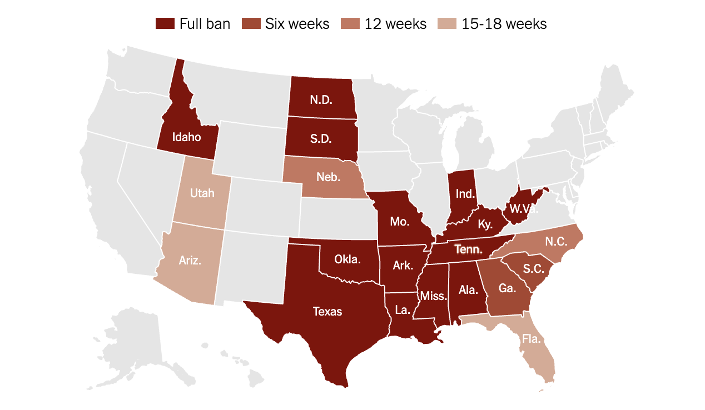

## US Infant Mortality Rates

<br>

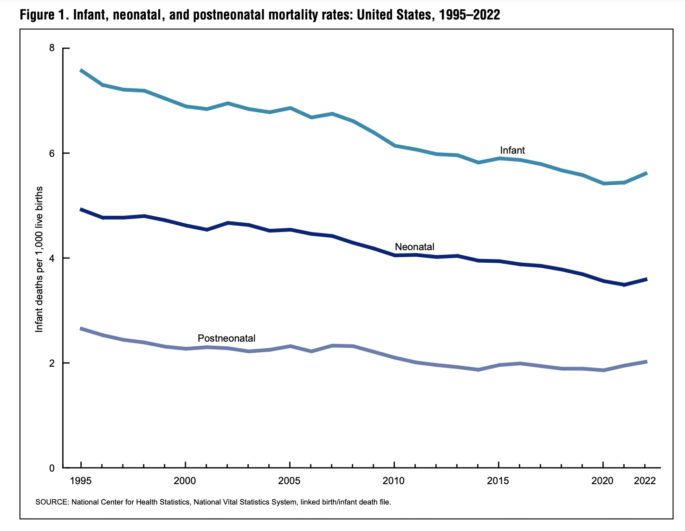

<br>
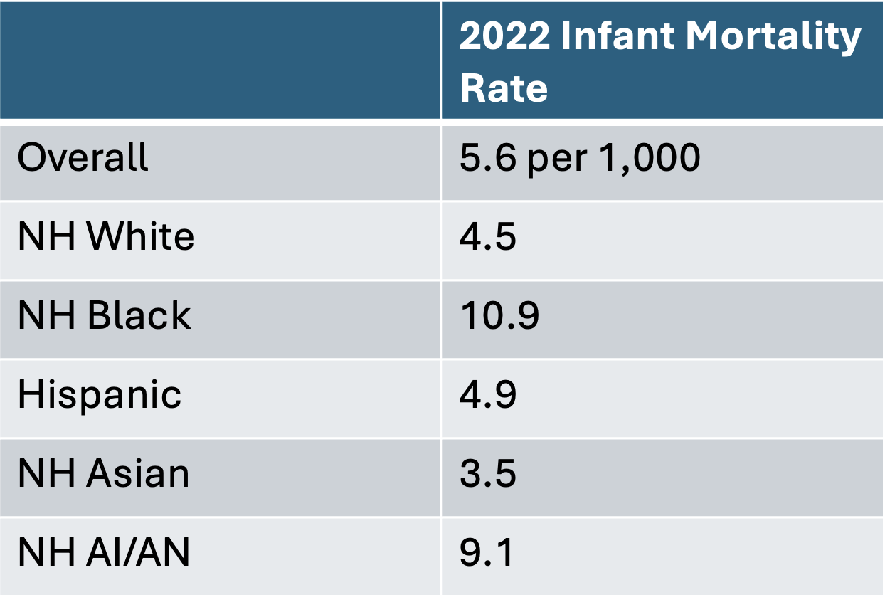

<center>
Source: Washington Post, August 18, 2022
</center>

## Early Evidence on Impacts

-   States with abortion bans experienced an average 2.3% increase in births in first half of 2023 (Dench, Pineda-Torres, and Myers 2024)

-   By race/ethnicity: greater impact among non-Hispanic Black and Hispanic individuals (Dench, Pineda-Torres, and Myers 2024; Caraher 2024) and greater impact among 20-24-year-olds (Dench, Pineda-Torres, and Myers 2024)

-   ~13% increase in infant deaths; 8% increase in the infant mortality rate (Gemmill et al. 2024)

<!-- - Only one prior study evaluated race/ethnicity group estimates of infant mortality in Texas -->
<!-- <center>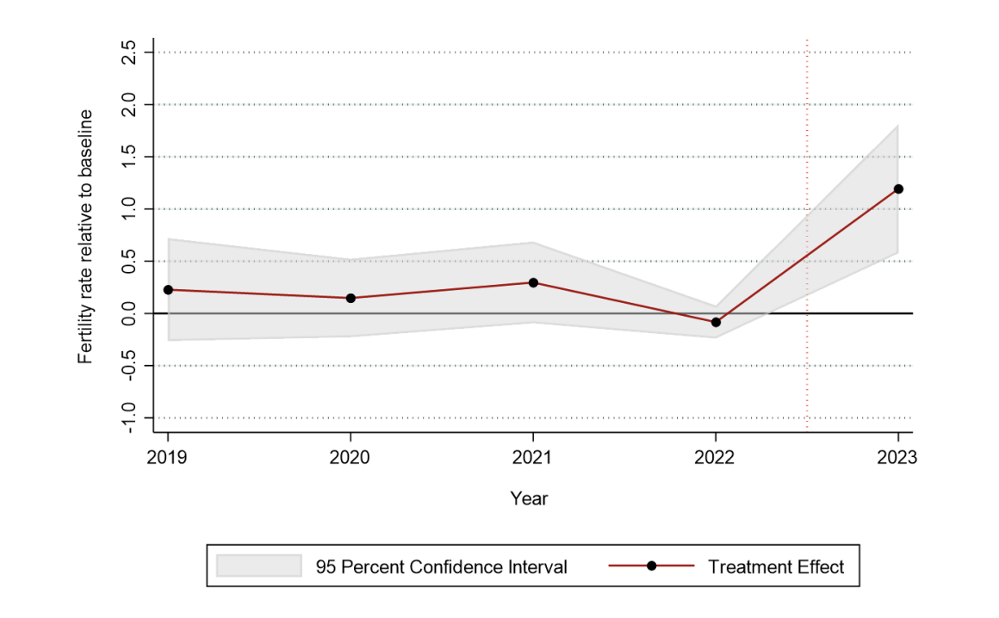{width=70%}</center> -->
<!-- ## Impacts on Infant Mortality


::: {.columns}
::: {.column width="100%"}

:::
::: -->
<!-- ## Heterogeneous Impacts of Abortion Bans? {.smaller}

- Differences in pre-Dobbs abortion rates

- Disparities in ability to overcome barriers to abortion

- State-specific characteristics -->

## Study Objectives

-   To estimate sociodemographic variation in the impact of abortion bans on subnational **birth rates** in the US through the end of 2023

    -   By age, race/ethnicity, marital status, educational attainment, insurance type

. . .

-   To estimate variation in the impact of abortion bans on subnational **infant mortality** in the US through the end of 2023
    -   By race/ethnicity, timing of death, cause of death

## Fertility Trends

<!-- 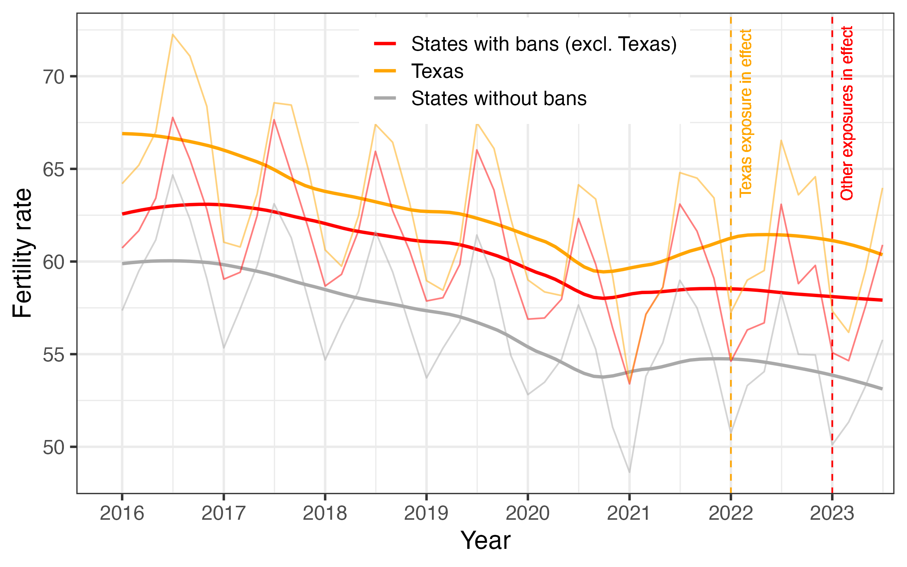 -->

``` r
df <- read_csv("data/fertility_df.csv")
```

    New names:
    Rows: 2448 Columns: 54
    ── Column specification
    ──────────────────────────────────────────────────────── Delimiter: "," chr
    (2): state, quarter dbl (51): ...1, year, bmcode, births_age1524,
    births_age2534, births_age354... date (1): time
    ℹ Use `spec()` to retrieve the full column specification for this data. ℹ
    Specify the column types or set `show_col_types = FALSE` to quiet this message.
    • `` -> `...1`

``` r
df |>
  mutate(
          start_date = ym(paste(year, "-", bmcode * 2 - 1)),
          end_date = start_date + months(2) - days(1)
        ) -> df


fill_in_missing_denoms <- function(dat) {
    pop_index_2022 <- which.max(dat$year == 2022)
    pop_index_2021 <- which.max(dat$year == 2021)
    dat %>% mutate_at(vars(contains("pop")), ~ ifelse(is.na(.), .[pop_index_2022]^2 / .[pop_index_2021], .))
}

## Hacky imputation
df <- df %>%
    group_by(state) %>%
    group_modify(~ fill_in_missing_denoms(.)) %>%
    ungroup()
```

    New names:
    New names:
    New names:
    New names:
    New names:
    New names:
    New names:
    New names:
    New names:
    New names:
    New names:
    New names:
    New names:
    New names:
    New names:
    New names:
    New names:
    New names:
    New names:
    New names:
    New names:
    New names:
    New names:
    New names:
    New names:
    New names:
    New names:
    New names:
    New names:
    New names:
    New names:
    New names:
    New names:
    New names:
    New names:
    New names:
    New names:
    New names:
    New names:
    New names:
    New names:
    New names:
    New names:
    New names:
    New names:
    New names:
    New names:
    New names:
    New names:
    New names:
    New names:
    • `...1` -> `...2`

``` r
df$time <- lubridate::ymd(paste0(df$year, "-", 2*df$bmcode-1, "-01"))
df <- df %>% filter(time <= "2024-07-01" & time >= "2016-01-01") 
df$dobbs_code <- df$dobbscodev2
df <- df %>% group_by(state) %>% fill(exposed_births, .direction="down") %>% ungroup()
df <- df %>% group_by(state) %>% fill(exposed_infdeaths, .direction="down") %>% ungroup()

df %>% group_by(state) %>%
  mutate(ban = ifelse(any(exposed_births == 1), "Exposed (excl. Texas)", "Unexposed")) %>%
  mutate(ban = ifelse(is.na(ban), "Unexposed", ban)) %>% 
  mutate(ban = ifelse(state == "Texas", "Texas", ban)) %>%
  group_by(ban, time) %>% 
  summarize(births_total = sum(births_total), pop_total=sum(pop_total), exposed_births=mean(exposed_births)) %>% 
  mutate(birthrate = births_total/pop_total*1000*6) %>%
  ungroup() %>% 
  ggplot() + 
  geom_smooth(aes(x=time, y=birthrate, col=ban), span=0.5, se=FALSE) + 
  geom_line(aes(x=time, y=birthrate, col=ban), alpha=0.5) +
  theme_bw(base_size=16) + 
  theme(legend.position = c(0.75, 0.99), legend.justification = c(1, 1),
  #legend.background = element_blank(),  # Make legend background transparent
  legend.title = element_blank()  ) +
  scale_color_manual(values=c("#003660", "#FEBC11", "dark gray"),
                      labels=c("States with bans (excl. Texas)", "Texas", "States without bans")) + 
                
  ylab("Fertility rate (births per 1,000 women)") + xlab("Year") +
  scale_x_date(
      date_breaks = "1 year",  # Set axis labels at yearly intervals
      date_labels = "%Y",
      limits=c(as.Date("2015-12-01"), as.Date("2023-08-01"))
  ) + guides(linetype="none") +
  geom_vline(xintercept=lubridate::date("2022-01-01"), color="#FEBC11", linetype="dashed") +
  geom_vline(xintercept=lubridate::date("2023-01-01"), color="#003660", linetype="dashed") +
  geom_text(x=lubridate::date("2022-02-01"), y=68, label="Texas exposure in effect", vjust=1, 
  angle=90, color="#FEBC11", size=3.5) + 
  geom_text(x=lubridate::date("2023-02-01"), y=68, label="Other exposures in effect", vjust=1, 
  angle=90, color="#003660", size = 3.5) + 
  # 12.5))
  coord_cartesian(xlim=c(as.Date("2015-12-01"), as.Date("2023-04-01")))
```

    `summarise()` has grouped output by 'ban'. You can override using the `.groups`
    argument.

    Warning: A numeric `legend.position` argument in `theme()` was deprecated in ggplot2
    3.5.0.
    ℹ Please use the `legend.position.inside` argument of `theme()` instead.

    `geom_smooth()` using method = 'loess' and formula = 'y ~ x'

    Warning: Removed 6 rows containing non-finite outside the scale range
    (`stat_smooth()`).

    Warning: Removed 6 rows containing missing values or values outside the scale range
    (`geom_line()`).


## Infant Mortality Trends

``` r
df <- read_csv("data/mortality_df.csv")
```

    New names:
    Rows: 1224 Columns: 33
    ── Column specification
    ──────────────────────────────────────────────────────── Delimiter: "," chr
    (2): state, quarter dbl (30): ...1, year, bacode, births_nhblack,
    births_nhwhite, births_hisp, ... date (1): time
    ℹ Use `spec()` to retrieve the full column specification for this data. ℹ
    Specify the column types or set `show_col_types = FALSE` to quiet this message.
    • `` -> `...1`

``` r
aggregations <- read_csv("data/dobbs_aggregate_data.csv")
```

    Rows: 100 Columns: 12
    ── Column specification ────────────────────────────────────────────────────────
    Delimiter: ","
    chr  (1): expcat
    dbl (11): year, bacode, deaths_nhblack, deaths_nhwhite, deaths_hisp, deaths_...

    ℹ Use `spec()` to retrieve the full column specification for this data.
    ℹ Specify the column types or set `show_col_types = FALSE` to quiet this message.

``` r
df$time <- paste(df$year, df$bacode * 6 - 5, "01", sep="-") %>% ymd()
aggregations$time <- paste(aggregations$year, aggregations$bacode * 6 - 5, "01", sep="-") %>% ymd()
df <- df %>% filter(time >= "2012-01-01")
aggregations <- aggregations %>% filter(time >= "2012-01-01")

df |>
  mutate(
          start_date = ym(paste(year, "-", bacode * 6 - 5)),
          end_date = start_date + months(6) - days(1)
        ) -> df


fill_in_missing_denoms <- function(dat) {
    pop_index_2022 <- which.max(dat$year == 2022)
    pop_index_2021 <- which.max(dat$year == 2021)
    dat %>% mutate_at(vars(contains("pop")), ~ ifelse(is.na(.), .[pop_index_2022]^2 / .[pop_index_2021], .))
}

## Hacky imputation
df <- df %>%
    group_by(state) %>%
    group_modify(~ fill_in_missing_denoms(.)) %>%
    ungroup()
```

    New names:
    New names:
    New names:
    New names:
    New names:
    New names:
    New names:
    New names:
    New names:
    New names:
    New names:
    New names:
    New names:
    New names:
    New names:
    New names:
    New names:
    New names:
    New names:
    New names:
    New names:
    New names:
    New names:
    New names:
    New names:
    New names:
    New names:
    New names:
    New names:
    New names:
    New names:
    New names:
    New names:
    New names:
    New names:
    New names:
    New names:
    New names:
    New names:
    New names:
    New names:
    New names:
    New names:
    New names:
    New names:
    New names:
    New names:
    New names:
    New names:
    New names:
    New names:
    • `...1` -> `...2`

``` r
df$dobbs_code <- df$dobbscodev2
df <- df %>% group_by(state) %>% fill(exposed_infdeaths, .direction="down") %>% ungroup()

df <- df %>% group_by(state) %>% fill(exposed_infdeaths, .direction="down") %>% ungroup()
df <- df %>% group_by(state) %>% mutate(ban = ifelse(any(exposed_infdeaths == 1, na.rm=TRUE), TRUE, FALSE))


df$births_con <- df$births_noncon <- df$births_total

df$births_neo <- df$births_nonneo <- df$births_total
df$deaths_nonneo <- df$deaths_total - df$deaths_neo

agg_births <- df %>% select(state, year, bacode, time, starts_with("births"), exposed_infdeaths) %>% 
    group_by(state) %>%
    mutate(ban = ifelse(any(exposed_infdeaths == 1), "Exposed (excl. Texas)", "Unexposed")) %>%
    mutate(ban = ifelse(is.na(ban), "Unexposed", ban)) %>% 
    mutate(ban = ifelse(state == "Texas", "Texas", ban)) %>% 
    ungroup() %>% 
    pivot_longer(starts_with("births"), names_pattern="births_(.*)", names_to="category", values_to="births") %>%
    group_by(ban, time, category) %>% 
    summarize(births=sum(births)) %>% ungroup() %>% 
    mutate(state = ban)
```

    `summarise()` has grouped output by 'ban', 'time'. You can override using the
    `.groups` argument.

``` r
agg_deaths <- df %>% select(-starts_with("births")) %>% 
    filter(state == "Texas") %>% bind_rows(aggregations %>% mutate(state = expcat)) %>% 
    pivot_longer(cols=starts_with("deaths"), names_pattern = "deaths_(.*)", names_to="category", values_to="deaths") %>%
    select(time, category, deaths, state, exposed_infdeaths) %>%
    mutate(state = recode(state, "exp"="Exposed (excl. Texas)", "Texas"="Texas", "unexp"="Unexposed"))

agg_df <- left_join(agg_deaths, agg_births, by=c("state", "time", "category"))

agg_df_total <- agg_df %>% mutate(mortality_rate = deaths / births * 1000) %>%
  filter(category == "total") %>%
  mutate(ban = (time >= "2022-07-01") & (state == "Texas") | 
               (time >= "2023-01-01") & (state == "Exposed (excl. Texas)"))


agg_df_total <- agg_df_total %>% arrange(time)


## span = 0.5
smooth_texas <- predict(loess(mortality_rate ~ as.numeric(time), data = agg_df_total %>% filter(state == "Texas") %>% arrange(time), span=0.5))
smooth_unexposed <- predict(loess(mortality_rate ~ as.numeric(time), data = agg_df_total %>% filter(state == "Unexposed") %>% arrange(time), span=0.5))
smooth_exposed <- predict(loess(mortality_rate ~ as.numeric(time), data = agg_df_total %>% filter(state == "Exposed (excl. Texas)") %>% arrange(time), span=0.5))


agg_df_total$smooth <- numeric(nrow(agg_df_total))

agg_df_total$smooth[agg_df_total$state == "Texas"] <- smooth_texas
agg_df_total$smooth[agg_df_total$state == "Exposed (excl. Texas)"] <- smooth_exposed
agg_df_total$smooth[agg_df_total$state == "Unexposed"] <- smooth_unexposed


tmp_tx <- agg_df_total %>% filter(state == "Texas", time == "2022-07-01")
tmp_tx$ban = FALSE
tmp_exp <- agg_df_total %>% filter(state == "Exposed (excl. Texas)", time == "2023-01-01")
tmp_exp$ban = FALSE
agg_df_total <- bind_rows(agg_df_total, tmp_tx, tmp_exp)
agg_df_total <- agg_df_total %>% arrange(time)

agg_df_total %>%
  ggplot() + 
  geom_smooth(aes(x=time, y=mortality_rate, col=state), span=0.5, se=FALSE) + 
  geom_line(aes(x=time, y=mortality_rate, col=state), alpha=0.5) +
  theme_bw(base_size=16) + 
  theme(legend.position = c(0.99, 0.99), legend.justification = c(1, 1),
  #legend.background = element_blank(),  # Make legend background transparent
  legend.title = element_blank()  ) +
  scale_color_manual(values=c("#003660", "#FEBC11", "dark gray"),
                      labels=c("States with bans (excl. Texas)", "Texas", "States without bans")) + 
                
  ylab("Infant Mortality Rate (per 1000 live births)") + xlab("Year") +
  scale_x_date(
      date_breaks = "1 year",  # Set axis labels at yearly intervals
      date_labels = "%Y",
      limits=c(as.Date("2012-01-01"), as.Date("2023-08-01"))
  ) + guides(linetype="none") +
  geom_vline(xintercept=lubridate::date("2022-01-01"), color="#FEBC11", linetype="dotted", size=1.1) +
  geom_vline(xintercept=lubridate::date("2023-01-01"), color="#003660", linetype="dotted",size=1.1) +
  geom_text(x=lubridate::date("2022-02-01"), y=6.2, label="Texas exposure in effect", vjust=1, 
  angle=90, color="#FEBC11", size=2.5) + 
  geom_text(x=lubridate::date("2023-02-01"), y=6.4, label="Other exposures in effect", vjust=1, 
  angle=90, color="#003660", size = 2.5) +
  coord_cartesian(xlim=c(as.Date("2012-04-01"), as.Date("2023-04-01")))
```

    Warning: Using `size` aesthetic for lines was deprecated in ggplot2 3.4.0.
    ℹ Please use `linewidth` instead.

    `geom_smooth()` using method = 'loess' and formula = 'y ~ x'


<!-- 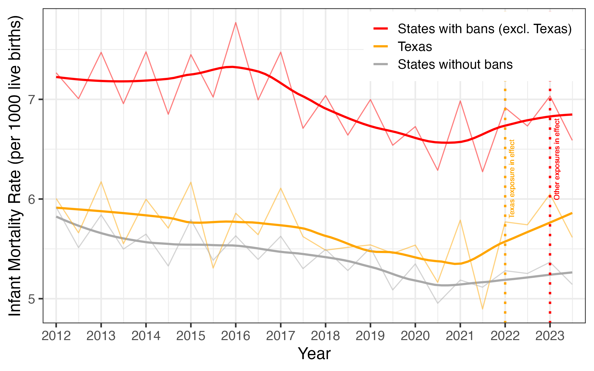 -->

## Overall Analytic Approach

-   Today: focus methods discussion on infant mortality data
-   Models for the fertility data are very similar
-   Bayesian panel data approach

. . .

-   Poisson latent factor model
    -   Fertility: model bimonthly number of births with population offset
    -   Infant mortality: model biannual number of deaths with live birth offset
-   Model state-by-subgroup-specific impacts separately by characteristic
-   States without bans and pre-exposure outcomes in all states inform counterfactual

## Infant Mortality Approach

-   Outcome: infant mortality rate (deaths per 1,000 live births)
-   Exposure: 6-week or complete abortion ban (14 states[^1]), staggered adoption
-   Pre-policy period: January 2012 through ~December 2022
-   Treated period: ~January 2023 through December 2023

. . .

-   Subgroups
    -   Race/ethnicity: non-Hispanic White, non-Hispanic Black, Hispanic, and Other
    -   Timing: neonatal (\<28 days), non-neonatal
    -   Cause of death: congenital, non-congenital

## Panel Data

-   Panel with $n$ states and $T$ time periods
-   Potential outcomes $Y_{it}(0)$, $Y_{it}(1)$ and a binary exposure indicator $W_{it} \in \{0,1\}$
-   We observe for each unit the pair $Y_i, W_i$ where
    $Y_{it} \equiv Y_{it}(W_{it}) = \begin{cases}
    Y_{it}(0) & \text{if } W_{it} = 0\\
    Y_{it}(1) & \text{if } W_{it} = 1
    \end{cases}$

## Causal Inference for Panel Data

Assumptions:

-   Well-defined exposure: {any complete or 6-week abortion ban} vs {no ban}

-   No anticipation: no effect of abortion restrictions prior to exposure

-   No spillovers across states: outcomes only depend on own state's policy

. . .

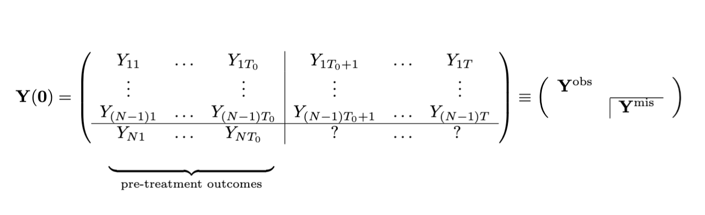

## Causal Inference for Panel Data

Some common strategies:

-   Interrupted Time Series (horizontal)
-   Synthetic Control Methods and Factor Models (vertical)
-   Differences in Differences(DID) and Two-Way-Fixed-Effects (TWFE)

<br>

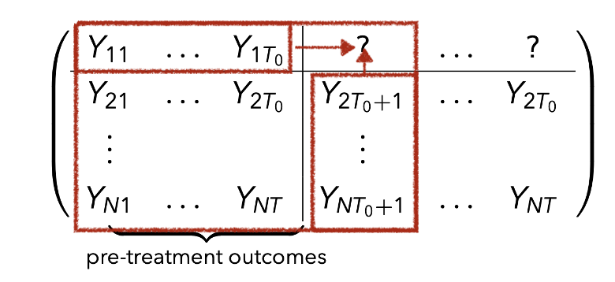

<br>

<!-- ## Gap Plot - Texas

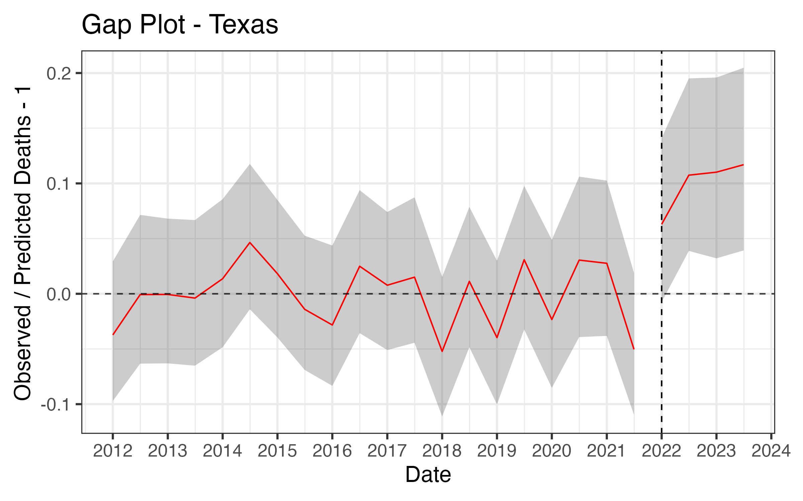 -->

## Challenges with Infant Death Data

-   Infant death counts are small and discrete
-   Missing data: CDC Wonder excludes counts between 1 and 9
    -   Implications for level of temporal aggregation
-   States and subgroups vary in size and mortality rates
-   Staggered Adoptions
    -   Bans were imposed at different times

## Temporal Aggregation

-   Missingness → CDC Wonder suppresses counts 1, ..., 9 (but not 0!)
    -   e.g., annual → no missingness; daily → high missingness
    -   Later: imputation approach
-   Noise → noise for (avg) annual counts ≪ (avg) monthly counts (see Sun, Ben-Michael, and Feller 2024)
    -   Further complicated by seasonality
-   Fertility → 2 month intervals (e.g., Jan-Feb 2023)
-   Mortality → 6 month intervals (e.g., Jan-June 2023)

## Subgroup Inference

-   Summing infant deaths over subroups yields total infant deaths

-   Inferred total infant mortality rates by differ depending on which subgroups are considered

-   Better to estimate the total effect by estimating the subgroup effects and summing or modeling the total effect directly?

## State Size and Sampling Variance

``` r
infant_mortality |>
    filter(state %in% c("Texas", "South Dakota")) |>
    ggplot(aes(x = date, y = deaths_total / births_total * 1000, color = state)) +
    geom_line(size = 1.2) +
    theme_bw() +
    theme(
        legend.position = "bottom",
        legend.title = element_blank(),
        plot.title = element_text(hjust = 0.5),
        axis.title = element_text(size = 16),
        legend.text = element_text(size = 16)
    ) +
    scale_color_manual(values = c("#003660", "#FEBC11")) +
    labs(
        title = "All Infant Deaths",
        x = "Date",
        y = "Infant Mortality Rate (per 1,000 live births)",
        caption = "Source: CDC Wonder, 2012-2023"
    )
```


## Subgroup Size and Variability

``` r
# Plot comparing NH Black and NH White infant mortality rates
infant_mortality |>
    filter(state %in% c("Texas", "Kentucky", "Missouri")) |>
    select(date, state, deaths_nhblack, deaths_nhwhite, births_nhblack, births_nhwhite) |>
    pivot_longer(
        cols = c(deaths_nhblack, deaths_nhwhite, births_nhblack, births_nhwhite),
        names_to = c(".value", "race"),
        names_pattern = "(.+)_(.+)"
    ) |>
    mutate(
        rate = deaths / births * 1000,
        race = case_when(
            race == "nhblack" ~ "Non-Hispanic Black",
            race == "nhwhite" ~ "Non-Hispanic White"
        )
    ) |>
    ggplot(aes(x = date, y = rate, color = race)) +
    geom_line(size = 1.2) +
    facet_wrap(~state, scales = "free_y") +
    theme_bw() +
    theme(
        legend.position = "bottom",
        legend.title = element_blank(),
        plot.title = element_text(hjust = 0.5),
        axis.title = element_text(size = 16),
        legend.text = element_text(size = 16),
        strip.text = element_text(size = 14)
    ) +
    scale_color_manual(values = c("#003660", "#FEBC11")) +
    labs(
        title = "Infant Mortality Rate by Race/Ethnicity",
        x = "Date",
        y = "Infant Mortality Rate (per 1,000 live births)",
        caption = "Source: CDC Wonder, 2012-2023"
    )
```


In these states population white ≈ 5-15x population black

## Implications

-   Pre-treatment balance should depend on state and subgroup size

-   Avoid overfitting to noise when groups are small

-   The difference between realized and counterfactual infant deaths, $Y_{it}(1) - Y_{it}(0)$, will be more variable for smaller states and subgroups

-   Suggests a need to regularize causal effect estimates

-   Want to encourage estimated infant mortality rates to be similar for the same state or same subgroup, while still allowing for the possibility of differences

## A Probabilistic Bayesian Model

-   Explicitly incorporate a missing data model
-   Staggered adoption accounted for in the likelihood
-   Count data modeled via Poisson with offset based on state/group size
-   Hierarchical prior stabilize treatment effect estimates and partially pool effects by state and category
-   Uncertainty quantification for "free"

## Panel Model for Infant Deaths

$$
\begin{align}
Y_{ijt}(1) &\sim \text{Poisson}(\tau_{ijt} \cdot \rho_{ijt} \cdot B_{ijt})\\
Y_{ijt}(0) &\sim \text{Poisson}(\rho_{ijt} \cdot B_{ijt})
\end{align}
$$
for unit $i$, subgroup $j$, time $t$

. . .

-   $B_{ijt}$ is births (in thousands)
    -   Scales mortality rate to account for variability in state size
-   $\rho_{ijt}$ is the infant mortality rate **without** bans
-   $\tau_{ijt}\rho_{ijt}$ is the infant mortality rate **with** bans
-   $\tau_{ijt}$ is the multiplicate change in infant mortality rate due to bans

## Poisson Latent Factor Model

We assume the infant mortality rate in the "no ban" condition can be expressed as

$$\rho_{ijt} = \alpha_{ij}^{\text{state}} \cdot \alpha_{jt}^{\text{time}} \cdot \left(\sum_{k=1}^K \lambda_{ijk}\eta_{jkt}\right),$$

-   $\alpha_{ij}^{\text{state}}$ and $\alpha_{jt}^{\text{time}}$ are state and time-specific intercept
-   $\eta_{jkt} \in \mathbb{R}^+$ is the $k$th latent factor at time t, common to all states but unique to subcategory j
-   $\lambda_{ij.} \sim \text{Dirichlet}$ are the factor loadings for state i and category j
-   Model selection problem: choosing $K$ (rank)

## Hierarchical Prior on Causal Effects

Partially pool the exposure parameters $\tau_{ijt}$ across states and across subcategories, with state and subcategory prior distributions centered at zero:

$$
\begin{align}
\log(\tau_{ijt}) &\sim N\left(\beta_{ij}^{\text{state,sub}}, \sigma_\tau\right)\\
\beta_{ij}^{\text{state,sub}} &\sim N\left(\beta_i^{\text{state}} + \beta_j^{\text{sub}}, \sigma_\beta\right)\\
\beta_i^{\text{state}} &\sim N\left(0, \sigma_{\text{state}}\right)\\
\beta_j^{\text{sub}} &\sim N\left(0, \sigma_{\text{sub}}\right)
\end{align}
$$

## Shrinkage Across States

<br>
<center>
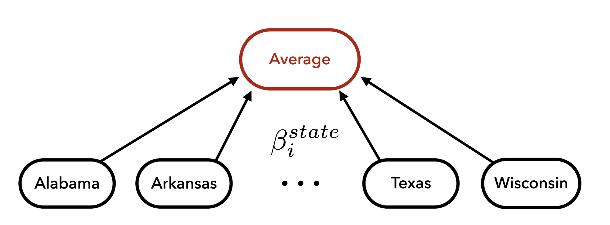
</center>

## Shrinkage Across Subcategories

<center>
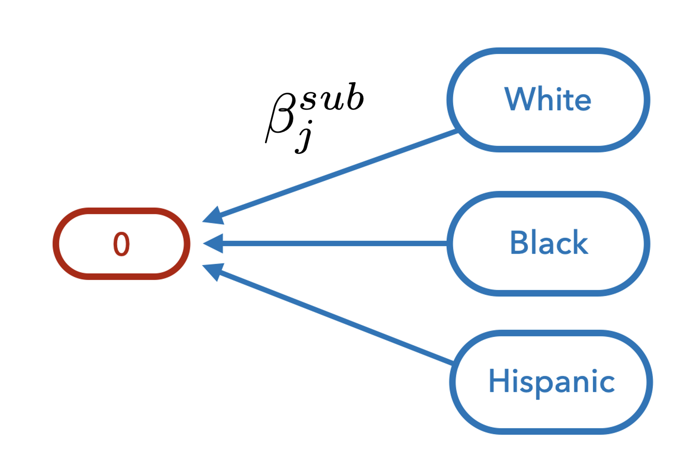
</center>

## Variation Across Multiple Sources

<center>
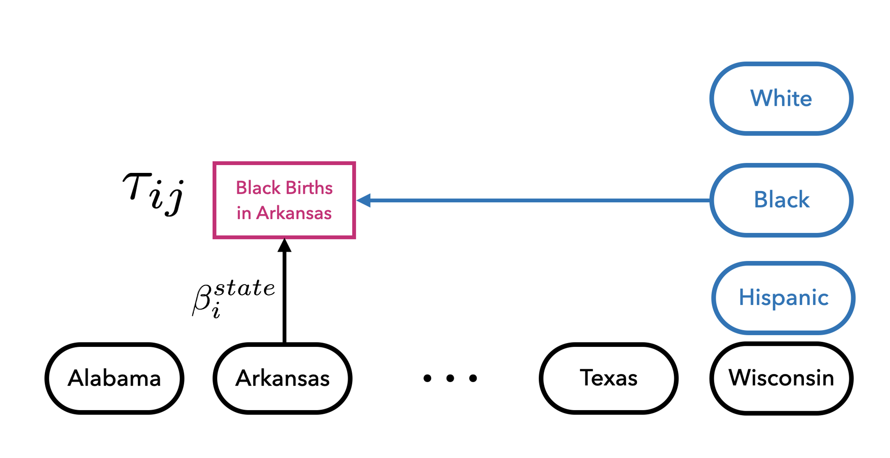
</center>

## MCMC Inference

-   Model implemented in probabilistic programming library, [numpyro](https://num.pyro.ai/en/stable/)

-   MCMC inference with Hamiltonian Monte Carlo

-   Run multiple chains, check Rhats and effective sample sizes

## MCMC Inference

-   Fit models for each category

    -   Mortality: Total, race/ethnicity, timing of death and type of death
    -   Fertility: Total, age, race/ethnicity, education, insurance

-   For each, fit models for multiple latent ranks and check fit

-   Code available at:

    -   [github.com/afranks86/dobbs_fertility](https://github.com/afranks86/dobbs_fertility)
    -   [github.com/afranks86/dobbs_infant_mortality](https://github.com/afranks86/dobbs_infant_mortality)

## Model Selection and Checking

-   In-sample checks:
    -   Question: how well does the model fit the observed data
    -   Tool: gap plots and posterior predictive comparisons
    -   Used to select latent factor rank
-   Out-of-sample checks
    -   Question: how well can we forecast
    -   Tool: placebo-in-time checks

## Fit and Gap Plot - Texas

<br>

<center>
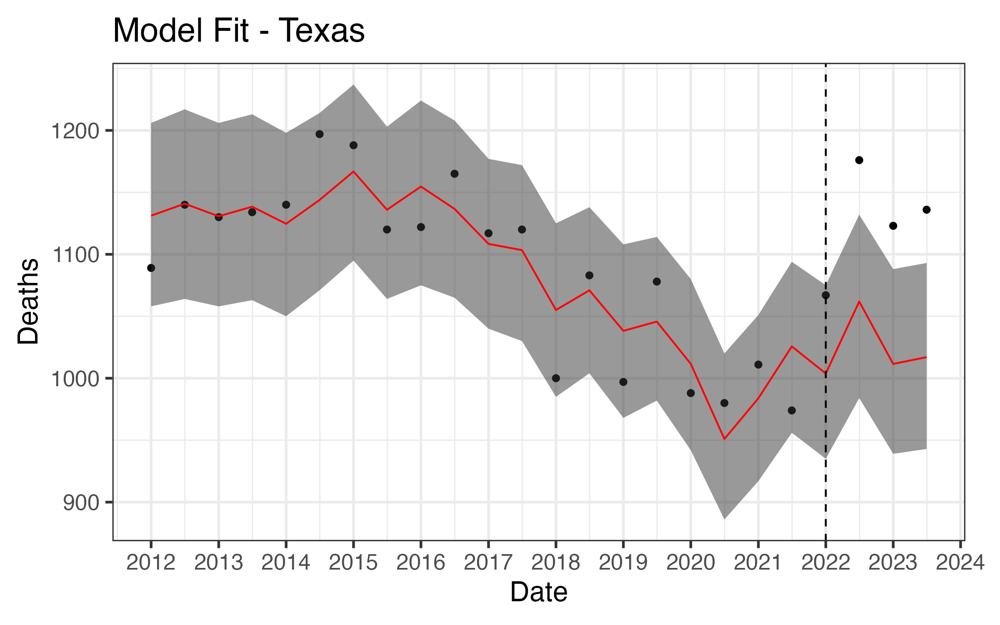
</center>

<center>

</center>

## Posterior Predictive Checks

-   Posterior predictive checks are used to assess how well a Bayesian model fits observed data

-   Unlike classical hypothesis testing, posterior predictive checks focus on practical significance of model inadequacies

-   $\mathbb{P}(T^{\text{pred}} > T^{\text{obs}} \mid Y) = \int \mathbb{P}(T^{\text{pred}} > T^{\text{obs}} \mid Y, \theta) \mathbb{P}(\theta \mid Y) d\theta$ should be far from 0 and 1.

## Posterior Predictive Checks

-   Maximum absolute residual: identify outliers inconsistent with the model: $T_{ij} = \tau_{ij} =  \max_{t} | r_{ijy}|$

-   Residual autocorrelation: check for remaining autocorrelation after controlling latent factors (and seasonal trends)

    -   Test statistic based on residual autocorrelation at different lags
    -   $T_{ij} = cor(r_{ijt}, r_{i,j,t+l})$

## PPC: Max Residual

<center>
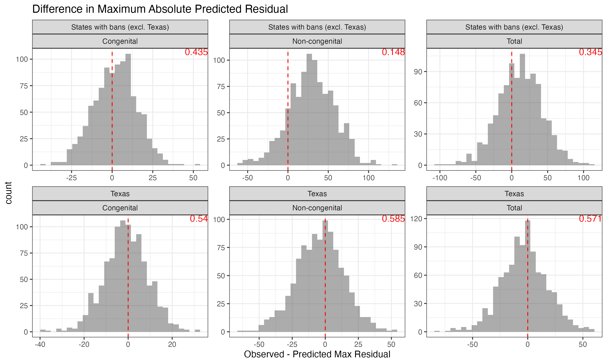
</center>

## Posterior Predictive Checks

Across-unit correlation: states should be uncorrelated after controlling for latent factors:

-   Test statistic based on eigenspectrum of residual correlation matrix

. . .

-   Let $\mathcal{C} = (c_{ii'})$ where ${c}_{ii'} =$ cor(${r}_{i\cdot}, {r}_{i'\cdot}$)
-   $T = \sigma_{max}(\mathcal{C})$ where $\sigma_{max}(\mathcal{C})$ is the largest singular of $\mathcal{C}$.
-   T should be small for uncorrelated state-residuals

## PPC: State Correlations

<center>
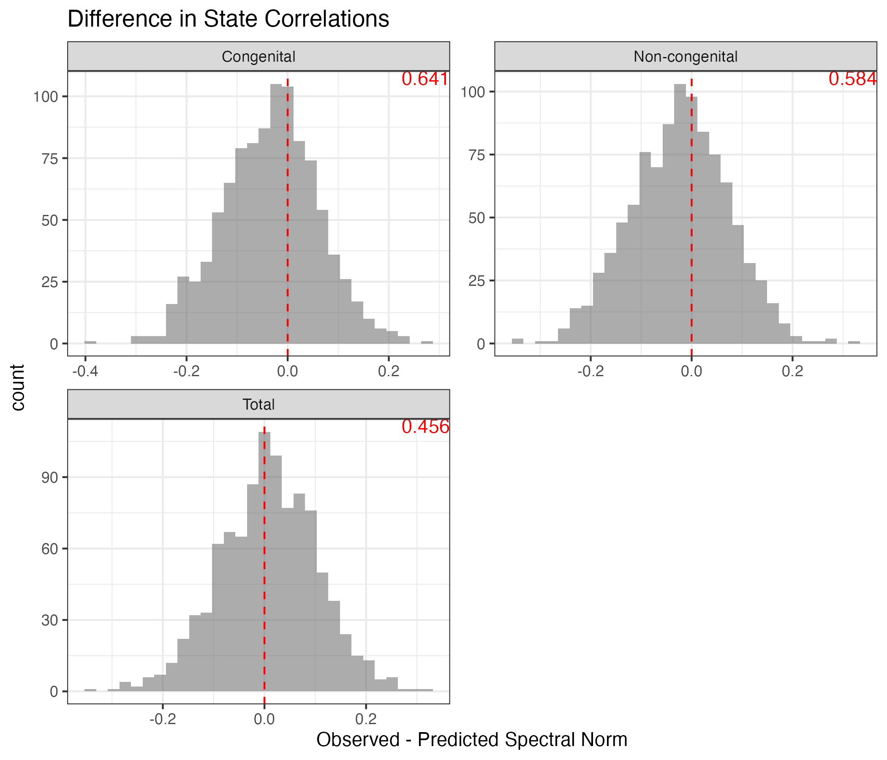
</center>

## Placebo-in-Time

<center>
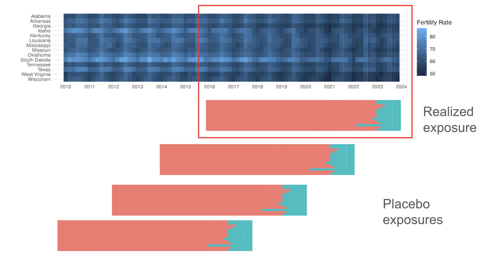
</center>

## Placebo-in-Time

<center>
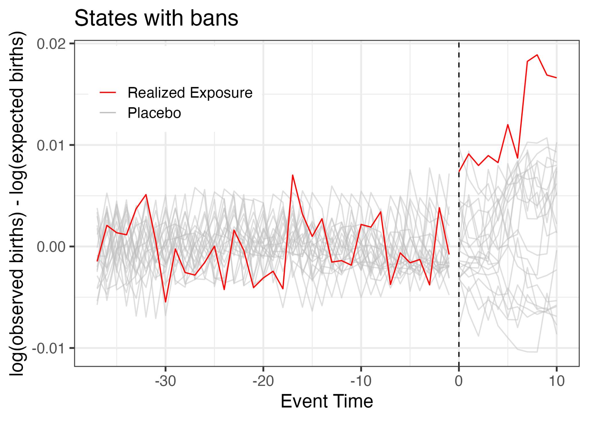
</center>

## Fertility Impact by Subgroup

<center>
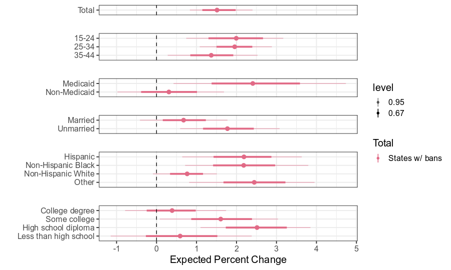
</center>
<center>
+1.7% overall increase
</center>

## State-Specific Effects on Inf. Mortality

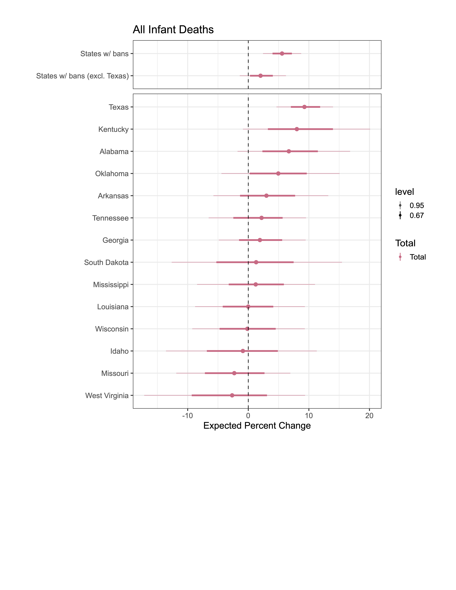

<br>
<br>
<br>

In banned states overall, the infant mortality rate increased by 5.6%

-   Kentucky: +7.5%
-   Texas: +8.9%

## Effect on Infant Mortality by Cause

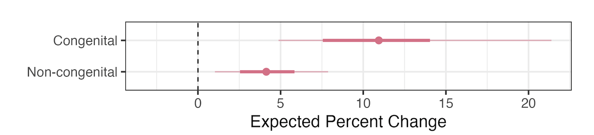

-   +10.9% increase in congenital deaths
-   +4.2% increase in non-congenital deaths

. . .

-   Note: majority of deaths attributable to the bans are non-congenital

## Effect on Infant Mortality by Race/Ethnicity

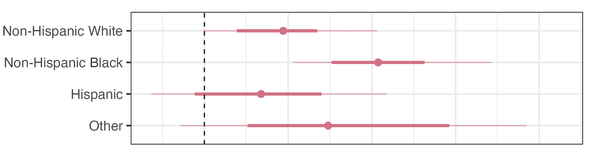

-   NH White: +5.1%
-   NH Black: +11.0%
-   Hispanic: +3.3%
-   NH Other: +9.9%

## Key Findings

-   Strong evidence that birth rates increased above expectation in states that banned abortion (+1.6%)
    -   Slightly smaller than prior studies

    -   Similar in magnitude of recent population-wide events

    -   Largest impacts among those experiencing greatest structural disadvantage (consistent across states)

. . .

-   Infant mortality increased in states with bans (+5.5%)
    -   Outsized influence of Texas
    -   Double the impact among non-Hispanic Black infants
    -   Larger relative increase among congenital deaths

## Implications

-   Profound health, social and economic implications of being unable to obtain an abortion (Greene Foster 2020)
-   State-specific policies and social contexts may present additional barriers for disadvantaged women
-   Bans exacerbate existing health disparities
-   Future work: impact of abortion bans on maternal morbidity, high-risk pregnancy care, and birth outcomes (e.g., preterm birth, low birthweight)

## Methodological Takeaways

-   Missing data and staggered adoption are easier to handle with Bayesian models

-   Hierarchical modeling of the treatment effect in panel data is an underexplored strategy for estimating heterogeneous treatment effects

-   Choice of temporal aggregation is important and tied to the amount of missingness

-   More work needed to understand how and when to disaggregate when inferring total effects

## Publications

<center>
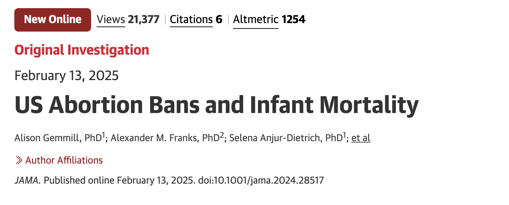
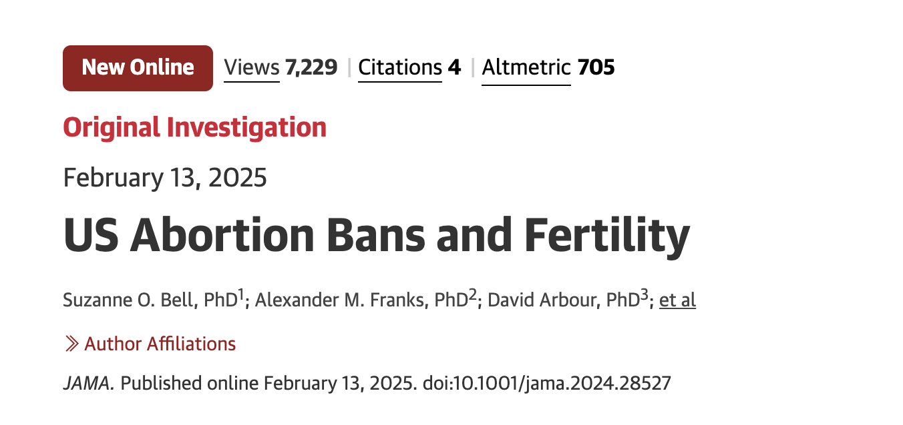
<center>

Papers published in JAMA. See Gemmill et al. (2025) and Bell et al. (2025). Supplementary materials contain modeling details.

## Thank you!

Bell, Suzanne O, Alexander M Franks, David Arbour, Selena Anjur-Dietrich, Elizabeth A Stuart, Eli Ben-Michael, Avi Feller, and Alison Gemmill. 2025. "US Abortion Bans and Fertility." *JAMA*.

Caraher, Raymond. 2024. "Do Abortion Bans Affect Reproductive and Infant Health? Evidence from Texas's 2021 Ban and Its Impact on Health Disparities." *Political Economy Research Institute Working Paper No* 606.

Dench, Daniel, Mayra Pineda-Torres, and Caitlin Myers. 2024. "The Effects of Post-Dobbs Abortion Bans on Fertility." *Journal of Public Economics* 234: 105124.

Gemmill, Alison, Alexander M. Franks, Selena Anjur-Dietrich, Amy Ozinsky, David Arbour, Elizabeth A. Stuart, Eli Ben-Michael, Avi Feller, and Suzanne O. Bell. 2025. "US Abortion Bans and Infant Mortality." *JAMA* 333 (15): 1315--23. <https://doi.org/10.1001/jama.2024.28517>.

Gemmill, Alison, Claire E Margerison, Elizabeth A Stuart, and Suzanne O Bell. 2024. "Infant Deaths After Texas' 2021 Ban on Abortion in Early Pregnancy." *JAMA Pediatrics* 178 (8): 784--91.

Sun, Liyang, Eli Ben-Michael, and Avi Feller. 2024. "Temporal Aggregation for the Synthetic Control Method." In *AEA Papers and Proceedings*, 114:614--17. American Economic Association 2014 Broadway, Suite 305, Nashville, TN 37203.

# Additional Slides

## Fertility Data

-   Bimonthly (e.g., January-February) counts of **live births** for 50 states and DC from birth certificates for 2014-2023
    -   Compiled by the National Center for Health Statistics (NCHS)
    -   2023 provisional data

. . .

-   Denominators (women 15-44) by state-year for 2014-2022 (imputed 2023)
    -   Census: total counts and by age, race/ethnicity
    -   American Community Survey: proportion by education, marital status, insurance (indirectly)

## Fertility Approach

-   Outcome: fertility rate (births per 1,000 per year)
-   Exposure: 6-week or complete abortion ban (14 states[^2]), staggered adoption
-   Pre-policy period: January 2014 through ~December 2022
-   Treated period: ~January 2023 through December 2023

. . .

-   Subgroups
    -   Age: 15-24, 25-34, 35-44
    -   Race/ethnicity: non-Hispanic White, non-Hispanic Black, Hispanic, and Other
    -   Marital status: married, not married
    -   Educational attainment: \<high school, high school degree, some college, college degree+
    -   Insurance payer for the delivery: Medicaid, non-Medicaid

## Infant Mortality Data

-   Biannual (e.g., January-June) counts of **infant deaths (\< 1 year)** for 50 states and DC from death certificates for 2012-2023
    -   2023 provisional data
    -   Impute suppressed data
-   Denominators (live births) by state-biannual period for 2012-2023 from birth certificates

## Missing Data

<center>
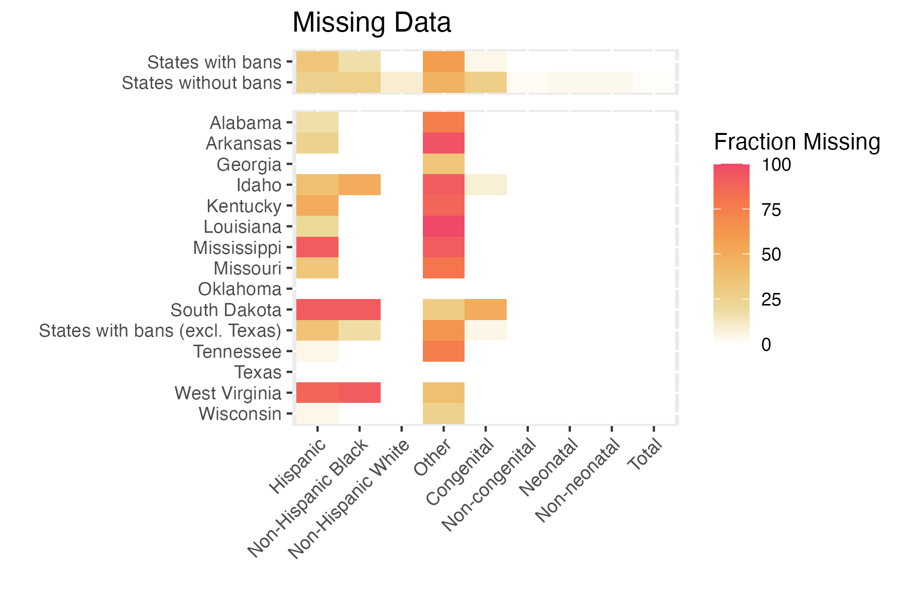
</center>

Note: missingness depends on level of temporal aggregation

## Median Infant Deaths per Half-Year

<center>
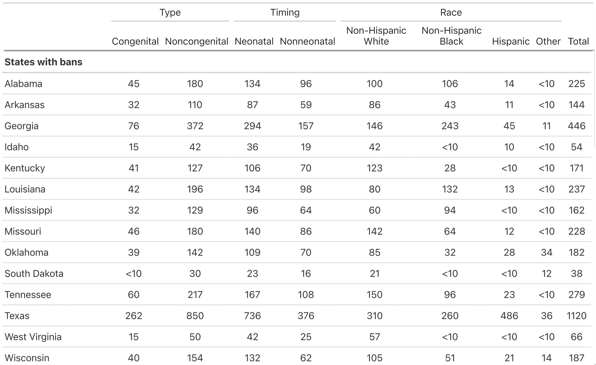
</center>

## State-Specific Effects on Fertility Rate

<center>
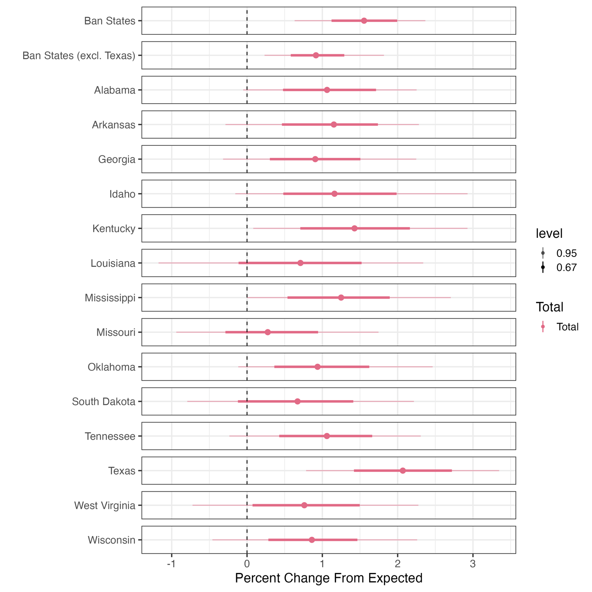
</center>

<br>
<br>
<br>

-   Range: 0.6% - 2.1%

-   Overall: +1.7%

-   Non-Texas: +0.9%

## Likelihood - Infant Mortality

Let $M_{ijt}$ denote the indicator for suppressed counts, with $M_{ijt}=1$ if $0 <  Y_{ijt}^{\text{obs}} < 10$ and $M_{ijt}=0$ otherwise.
% If we let $B_{ijt}^{obs} = B_{ijt}(G_i)^{D_{ijt}}B_{ijt}(\infty)^{(1-D_{ijt})}$ then,
The observed data likelihood can then be written as:
where $\text{Pois}(Y_{ijt}; \rho_{ijt}B_{ijt}^{obs})$ is the poisson PMF with mean $\rho_{ijt}B_{ijt}^{obs}$ evaluated at $Y_{ijt}$; and
$$P_{\text{miss}}(\rho_{ijt}B_{ijt}^{obs}) = (F(9; \rho_{ijt}B_{ijt}^{obs}) - F(0; \rho_{ijt}B_{ijt}^{obs})), $$
where $F(a; \mu)$ is the CDF of a Poisson with mean $\mu$ evaluated at $a$ so that $P_{\text{miss}}(\mu_{ijt}) = F(9; \mu) - F(0; \mu)$ is the probability of observing a missing count between 1 and 9, inclusive.

[^1]: \*States include Alabama, Arkansas, Georgia, Idaho, Kentucky, Louisiana, Mississippi, Missouri, Oklahoma, South Dakota, Tennessee, Texas, West Virginia, Wisconsin

[^2]: States include Alabama, Arkansas, Georgia, Idaho, Kentucky, Louisiana, Mississippi, Missouri, Oklahoma, South Dakota, Tennessee, Texas, West Virginia, Wisconsin
