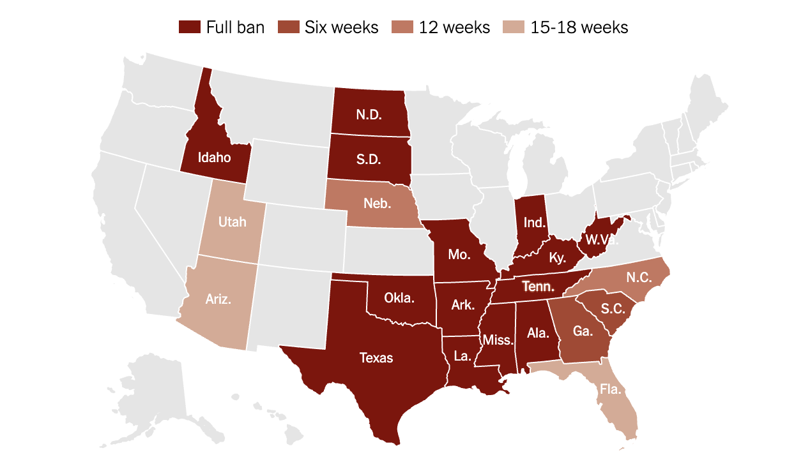
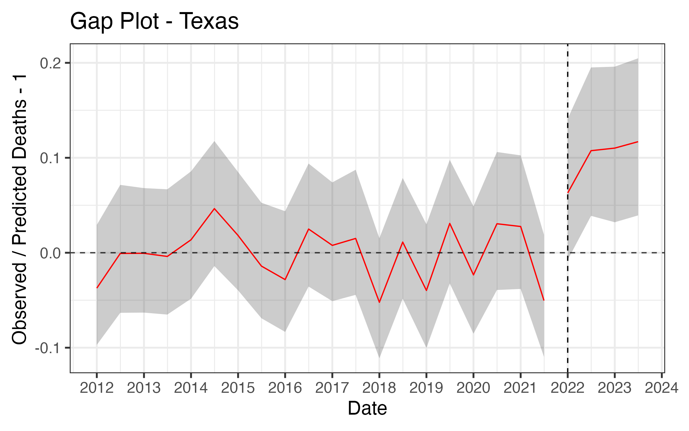
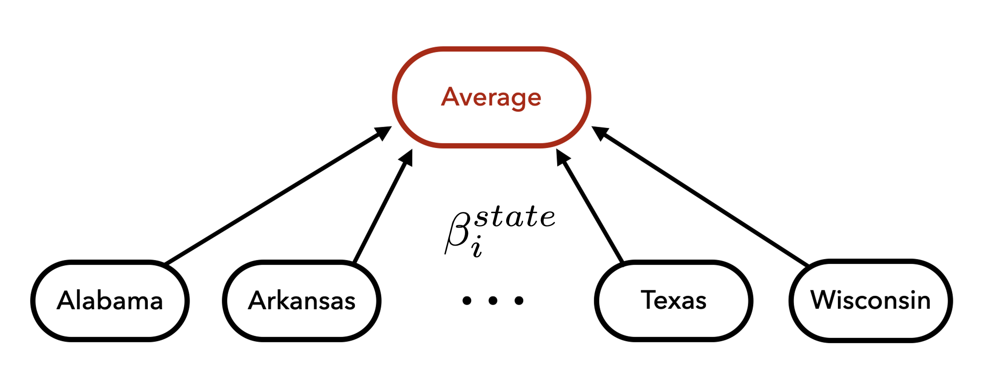
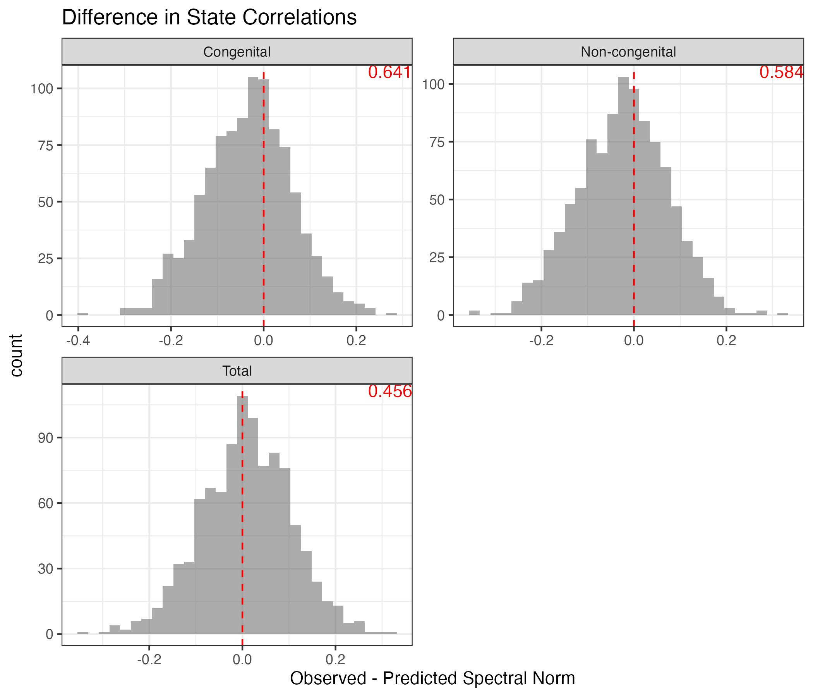
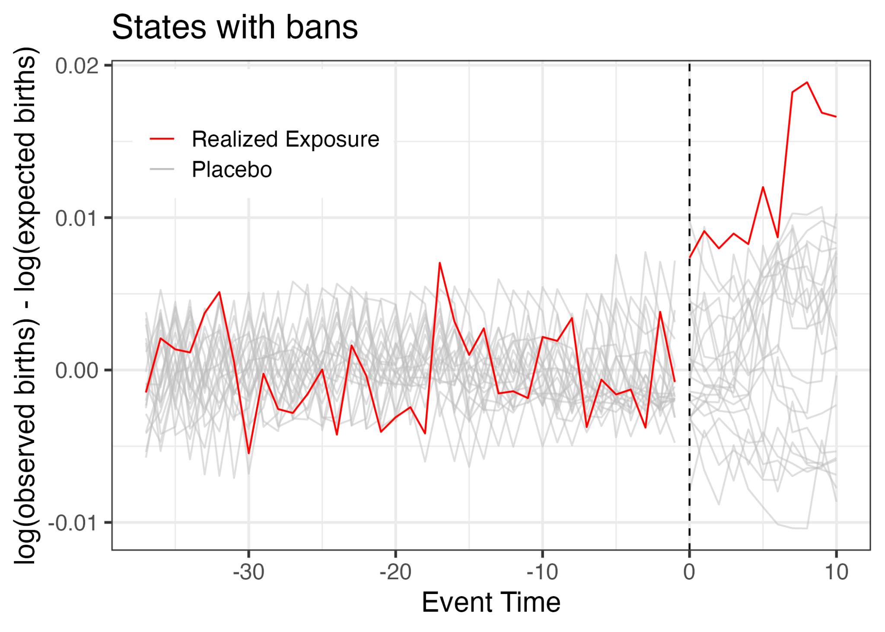
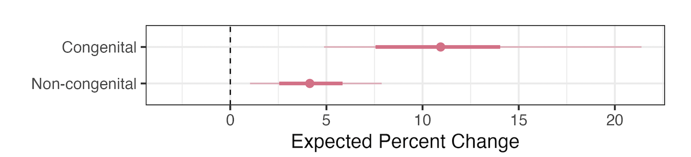

{r}{
    
}

## Research Team

::: {.columns}
::: {.column width="33%"}
{width="35%"}  
Elizabeth Stuart  
Statistician, Hopkins
:::

::: {.column width="33%"}
{width="35%"}  
Avi Feller  
Statistician, UC Berkeley
:::

::: {.column width="33%"}
{width="35%"}  
Joanne Rosen  
Legal expert, Hopkins
:::
:::

::: {.columns}
::: {.column width="33%"}
{width="35%"}  
Suzanne Bell  
Co-PI, Hopkins
:::

::: {.column width="33%"}
{width="35%"}  
David Arbour  
Statistician, Adobe
:::

::: {.column width="33%"}
{width="35%"}  
Eli Ben-Michael  
Statistician, Carnegie Mellon
:::
:::
:::

## Texas Senate Bill 8 {background-image="figs/texas_sb8.png" background-size="cover"}

::: {.absolute top="2%" right="5%" style="color: white; text-align: right;"}
Effectively bans abortion (Sept. 1, 2021)
:::

## Roe v. Wade Overturned

<!--  -->

## Abortion Bans Across the US

## Research Question

# Impact of US abortion bans on fertility and infant mortality, overall and across groups?

## Early Evidence on Fertility Impacts 

States with abortion bans experienced an average 2.3% increase in births in first half of 2023 (Dench et al. 2024)

## Impacts on Infant Mortality

::: {.columns}
::: {.column width="100%"}
- ~13% increase in infant deaths; 8% increase in the infant mortality rate
- Descriptive evidence suggesting that much of increase was due to an increase in infant deaths due to congenital anomalies
:::
:::

## Heterogeneous Impacts of Abortion Bans?

- Differences in pre-Dobbs abortion rates
- Disparities in ability to overcome barriers to abortion
- State-specific characteristics

## US Infant Mortality Rate by Race/Ethnicity (2022)

| Group | Rate (per 1,000) |
|-------|-----------------|
| Overall | 5.6 |
| NH White | 4.5 |
| NH Black | 10.9 |
| Hispanic | 4.9 |
| NH Asian | 3.5 |
| NH AI/AN | 9.1 |

Source: Washington Post, August 18, 2022

## Evidence of Heterogeneous Impacts?

- Only two prior studies examined variation in impact of abortion bans on fertility in US:
  - By race/ethnicity: greater impact among non-Hispanic Black (Caraher 2024) and Hispanic individuals (Dench et al 2023)
  - By age: greater impact among 20-24-year-olds (Dench et al 2023)
- Only one prior study evaluated race/ethnicity group estimates of infant mortality in Texas
  - Larger impacts observed among non-Hispanic Black infants (Caraher 2024)

## Study Objectives

- To estimate sociodemographic variation in the impact of abortion bans on subnational birth rates in the US through the end of 2023
  - By age, race/ethnicity, marital status, educational attainment, insurance type
- To estimate variation in the impact of abortion bans on infant mortality in the US through the end of 2023
  - By race/ethnicity, timing of death, cause of death

## Data and Methods {background-color="#f5f5f5"}

## Fertility Data

- Bimonthly (e.g., January-February) counts of **live births** for 50 states and DC from birth certificates for 2014-2023
  - Compiled by the NCHS
  - 2023 provisional data
- Denominators (women 15-44) by state-year for 2014-2022 (imputed 2023)
  - Census: total counts and by age, race/ethnicity
  - American Community Survey: proportion by education, marital status, insurance (indirectly)

## Fertility Trends

## Fertility Approach

- Outcome: fertility rate (births per 1,000 per year)
- Exposure: 6-week or complete abortion ban (14 states*), staggered adoption
- Pre-policy period: January 2014 through ~December 2022
- Treated period: ~January 2023 through December 2023
- Subgroups
  - Age: 15-24, 25-34, 35-44
  - Race/ethnicity: non-Hispanic White, non-Hispanic Black, Hispanic, and Other
  - Marital status: married, not married
  - Educational attainment: <high school, high school degree, some college, college degree+
  - Insurance payer for the delivery: Medicaid, non-Medicaid

*States include Alabama, Arkansas, Georgia, Idaho, Kentucky, Louisiana, Mississippi, Missouri, Oklahoma, South Dakota, Tennessee, Texas, West Virginia, Wisconsin

## Infant Mortality Data

- Biannual (e.g., January-June) counts of **infant deaths (< 1 year)** for 50 states and DC from death certificates for 2012-2023
  - 2023 provisional data
  - Impute suppressed data
- Denominators (live births) by state-biannual period for 2012-2023 from birth certificates

## Infant Mortality Trends

## Infant Mortality Approach {.smaller}

- Outcome: infant mortality rate (deaths per 1,000 live births)
- Exposure: 6-week or complete abortion ban (14 states*), staggered adoption
- Pre-policy period: January 2012 through ~December 2022
- Treated period: ~January 2023 through December 2023
- Subgroups
  - Race/ethnicity: non-Hispanic White, non-Hispanic Black, Hispanic, and Other
  - Timing: neonatal (<28 days), non-neonatal
  - Cause of death: congenital, non-congenital

*States include Alabama, Arkansas, Georgia, Idaho, Kentucky, Louisiana, Mississippi, Missouri, Oklahoma, South Dakota, Tennessee, Texas, West Virginia, Wisconsin

## Temporal Aggregation

- Missingness → CDC Wonder suppresses counts 1, …, 9 (but not 0!)
  - e.g., annual → no missingness; daily → high missingness
  - Later: imputation approach
- Noise → noise for (avg) annual counts ≪ (avg) monthly counts
  - Further complicated by seasonality
- Fertility → 2 month intervals (e.g., Jan-Feb 2023)
- Mortality → 6 month intervals (e.g., Jan-June 2023)

## Overall Analytic Approach 

- Today: focus methods discussion on infant mortality data
- Models for the fertility data are very similar
- Bayesian panel data approach
- Poisson latent factor model
  - Fertility: model bimonthly number of births with population offset
  - Infant mortality: model biannual number of deaths with live birth offset
- Model state-by-subgroup-specific impacts separately by characteristic
- States without bans and pre-exposure outcomes in all states inform counterfactual

## Panel Data

- Panel with $n$ states and $T$ time periods
- Potential outcomes $Y_{it}(0)$, $Y_{it}(1)$ and a binary exposure indicator $W_{it} \in \{0,1\}$
- We observe for each unit the pair $Y_i, W_i$ where
$Y_{it} \equiv Y_{it}(W_{it}) = \begin{cases}
Y_{it}(0) & \text{if } W_{it} = 0\\
Y_{it}(1) & \text{if } W_{it} = 1
\end{cases}$

## Causal Inference for Panel Data

"How many infant deaths would we have observed had the abortion bans not occurred?"

Some common strategies:

- Interrupted Time Series / Horizontal Regression models
- Differences in Differences(DID) and Two-Way-Fixed-Effects (TWFE)
- Synthetic Control Methods and Factor Models

## Gap Plot - Texas

## Challenges with Infant Death Data

- Infant death counts are small and discrete
- Missing data: CDC Wonder excludes counts between 1 and 9
  - Implications for level of temporal aggregation
- States and subgroups vary in size and mortality rates
- Staggered Adoptions
  - Bans were imposed at different times

## Missing Data

Note: missingness depends on level of temporal aggregation

## Median Infant Deaths per Half-Year

| State | Congenital | Noncongenital | Neonatal | Nonneonatal | NH White | NH Black | Hispanic | Other | Total |
|-------|------------|---------------|----------|-------------|---------|---------|----------|-------|-------|
| Alabama | 45 | 180 | 134 | 96 | 100 | 106 | 14 | <10 | 225 |
| Texas | 262 | 850 | 736 | 376 | 310 | 260 | 486 | 36 | 1120 |
| South Dakota | <10 | 30 | 23 | 16 | 21 | <10 | <10 | 12 | 38 |

## State Size and Sampling Variance

## State Size and R-squared vs Births

## Subgroup Size and Variability

In these states population white ≈ 5-15x population black

## Implications

- Pre-treatment balance should depend on state and subgroup size
- Avoid overfitting to noise when groups are small
- The difference between realized and counterfactual infant deaths, $Y_{it}(1) - Y_{it}(0)$, will be more variable for smaller states and subgroups
- Suggests a need to regularize causal effect estimates
- Want to encourage estimated infant mortality rates to be similar for the same state or same subgroup, while still allowing for the possibility of differences

## A Probabilistic Bayesian Model

- Explicitly incorporate a missing data model
- Staggered adoption accounted for in the likelihood
- Count data modeled via Poisson with offset based on state/group size
- Hierarchical prior stabilize treatment effect estimates and partially pool effects by state and category
- Uncertainty quantification for "free"

## Bayesian Panel Model for Infant Deaths

$$
\begin{align}
Y_{ijt}(1) &\sim \text{Poisson}(\tau_{ijt} \cdot \rho_{ijt} \cdot B_{ijt})\\
Y_{ijt}(0) &\sim \text{Poisson}(\rho_{ijt} \cdot B_{ijt})
\end{align}
$$

- unit $i$, subgroup $j$, time $t$
- $B_{ijt}$ is births (in thousands)
  - Scales mortality rate to account for variability in state size
- $\rho_{ijt}$ is the infant mortality rate **without** bans
- $\tau_{ijt}\rho_{ijt}$ is the infant mortality rate **with** bans
- $\tau_{ijt}$ is the multiplicate change in infant mortality rate due to bans

## Poisson Latent Factor Model

We assume the infant mortality rate in the "no ban" condition can be expressed as

$$\rho_{ijt} = \alpha_{ij}^{\text{state}} \cdot \alpha_{jt}^{\text{time}} \cdot \left(\sum_{k=1}^K \lambda_{ijk}\eta_{jkt}\right),$$

- $\alpha_{ij}^{\text{state}}$ and $\alpha_{jt}^{\text{time}}$ are state and time-specific intercept
- $\eta_{jkt} \in \mathbb{R}^+$ is the $k$th latent factor at time t, common to all states but unique to subcategory j
- $\lambda_{ij.} \sim \text{Dirichlet}$ are the factor loadings for state i and category j
- Model selection problem: choosing $K$ (rank)

## Hierarchical Prior on Causal Effects

Partially pool the exposure parameters $\tau_{ijt}$ across states and across subcategories, with state and subcategory prior distributions centered at zero:

$$
\begin{align}
\log(\tau_{ijt}) &\sim N\left(\beta_{ij}^{\text{state,sub}}, \sigma_\tau\right)\\
\beta_{ij}^{\text{state,sub}} &\sim N\left(\beta_i^{\text{state}} + \beta_j^{\text{sub}}, \sigma_\beta\right)\\
\beta_i^{\text{state}} &\sim N\left(0, \sigma_{\text{state}}\right)\\
\beta_j^{\text{sub}} &\sim N\left(0, \sigma_{\text{sub}}\right)
\end{align}
$$

## Shrinkage Across States

## Shrinkage Across Subcategories

## Variation Across Multiple Sources

## MCMC Inference

- Model implemented in probabilistic programming library, numpyro
- MCMC inference with Hamiltonian Monte Carlo
- Run multiple chains, check Rhats and effective sample sizes
- Fit models for each category
  - Mortality: Total, race/ethnicity, timing of death and type of death
  - Fertility: Total, age, race/ethnicity, education, insurance
- For each, fit models for multiple latent ranks and check fit
- Code available at:
  - github.com/afranks86/dobbs_fertility (fertility)
  - github.com/afranks86/dobbs_infant_mortality (infant mortality)

## Model Selection and Checking

- In-sample checks:
  - Question: how well does the model fit the observed data
  - Tool: gap plots and posterior predictive comparisons
  - Used to select latent factor rank
- Out-of-sample checks
  - Question: how well can we forecast
  - Tool: placebo-in-time checks

## Model Fit - Texas

## Gap Plot - Texas

## Posterior Predictive Checks

- Posterior predictive checks are used to assess how well a Bayesian model fits observed data
- Unlike classical hypothesis testing, posterior predictive checks focus on practical significance of model inadequacies
- Gist: choose a test statistic, generate data from fitted model (sample repeated from the "posterior predictive distribution") and compare to the test statistic on the observed data.

## Posterior Predictive Checks

- Maximum absolute residual: identify outliers inconsistent with the model
- Residual autocorrelation: check for remaining autocorrelation after controlling latent factors (and seasonal trends)
  - Test statistic based on residual autocorrelation at different lags
- Across-unit correlation: states should be uncorrelated after controlling for (latent) factors
  - Test statistic based on eigenspectrum of residual correlation matrix

## Posterior Predictive Check: Max Residual

## Posterior Predictive Check: State Correlations

## Placebo-in-Time

## Placebo Event Study

## Results: Fertility {background-color="#f0f8ff"}

## Model Fit and Gap Plot for Total Births in All Banned States

- +1.6% increase
- +20,107 additional births
- +0.9 per 1,000 women

## Fertility Impact by Subgroup

+1.7% overall increase

## Fertility Impact by Age

## Fertility Impact by Insurance and Marital Status

## Fertility Impact by Race/Ethnicity and Education

## Estimated State-Specific Effects on Total Fertility Rate

- Range: 0.6% - 2.1%
- Overall: +1.7% 
- Non-Texas: +0.9%

## Results: Infant Mortality {background-color="#fff0f0"}

## Estimated State-Specific Effects on Infant Mortality Rate

In banned states overall, the infant mortality rate increased by 5.6%

- Kentucky: +7.5%
- Texas: +8.9%

## Effect on Infant Mortality by Cause

- +10.9% increase in congenital deaths
- +4.2% increase in non-congenital deaths

## Effect on Infant Mortality by Race/Ethnicity

- NH White: +5.1%
- NH Black: +11.0%
- Hispanic: +3.3%
- NH Other: +9.9%

## Discussion {background-color="#f5f5f5"}

## Methods – Takeaways and Limitations

- Hierarchical modeling in panel data is an underexplored strategy for estimating for heterogeneous treatment effects
- Choice of temporal aggregation is important and tied to the amount of missingness
- Do not (yet) have access to counts at the intersection of sociodemographic categories

## Key Findings

- Strong evidence that birth rates increased above expectation in states that banned abortion (+1.6%)
  - Smaller than prior studies
  - Similar in magnitude of recent population-wide events
  - Largest impacts among those experiencing greatest structural disadvantage (consistent across states)
- Infant mortality increased in states with bans (+5.5%)
  - Outsized influence of Texas
  - Double the impact among non-Hispanic Black infants
  - Larger relative increase among congenital deaths

## Implications

- Profound health, social and economic implications of being unable to obtain an abortion (Greene Foster 2020)
- State-specific policies and social contexts may present additional barriers for disadvantaged women
- Bans exacerbate existing health disparities
- Future work: impact of abortion bans on maternal morbidity, high-risk pregnancy care, and birth outcomes (e.g., preterm birth, low birthweight)

## Thank you!

This work was supported by NICHD via the Hopkins Population Center (P2CHD042854) and an R01 (R01HD114292)

### Publications

- **US Abortion Bans and Infant Mortality**  
  JAMA, February 13, 2025, doi:10.1001/jama.2024.28517

- **US Abortion Bans and Fertility**  
  JAMA, February 13, 2025, doi:10.1001/jama.2024.28527